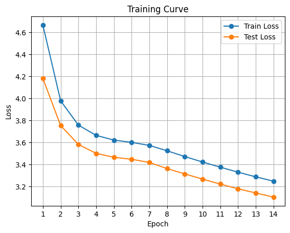
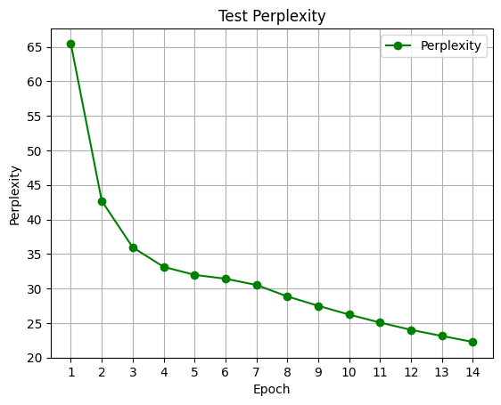
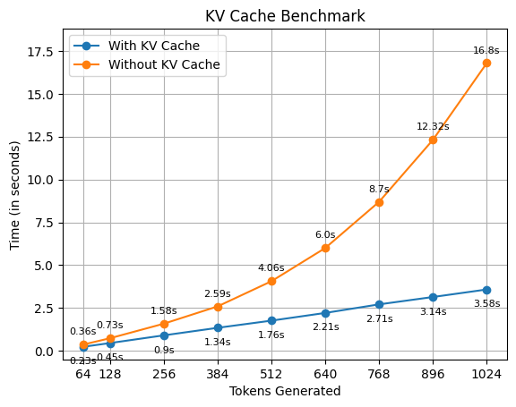
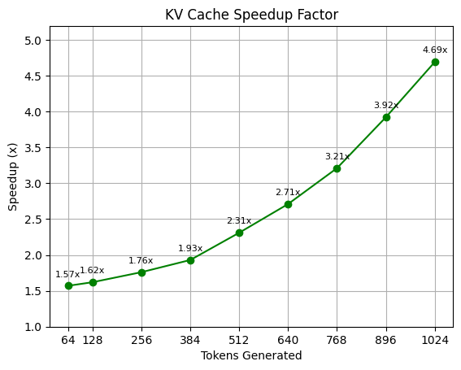

# BlockFormer

A decoder-only transformer language model built from scratch in PyTorch, trained on the [TinyStories](https://www.kaggle.com/datasets/thedevastator/tinystories-narrative-classification) dataset. The model implements core transformer components — multi-head attention, rotary positional encoding (RoPE), and KV caching for efficient autoregressive generation.

## Architecture

| Component | Details |
|---|---|
| Type | Decoder-only Transformer |
| Parameters | ~27M |
| Layers | 6 |
| Attention Heads | 8 |
| Model Dimension | 512 |
| FFN Dimension | 2048 |
| Positional Encoding | Rotary (RoPE) |
| Vocabulary | 16,000 (BPE via HuggingFace Tokenizers) |
| Max Sequence Length | 2048 |
| Weight Tying | Embedding ↔ Output projection |

## Training

Trained for 40 epochs on TinyStories using AdamW (lr=3e-4, weight decay=0.01) with mixed-precision training (FP16) and gradient clipping (max norm=1.0).

<p align="center">
  
</p>

<p align="center">
  
</p>

Note: The data for epoch 36-38 was lost :(

| Metric | Value |
|---|---|
| Final Train Loss | ~2.92 |
| Final Test Loss | ~2.81 |
| Final Perplexity | ~16.58 |

## KV Cache

The model supports KV caching for faster autoregressive text generation. Benchmarked on an NVIDIA Tesla T4:

<p align="center">
  
  
</p>

At 1024 tokens, KV caching achieves a **4.69x speedup** (3.58s vs 16.8s).

## Project Structure

```
BlockFormer/
├── model/
│   ├── attention.py       # Multi-Head Attention (MHA)
│   ├── rope.py            # Rotary Positional Encoding
│   └── transformer.py     # Decoder layers & BlockFormer model
├── data/
│   ├── dataset.py         # TinyStories dataset & collate function
│   └── BlockFormer.json   # BPE tokenizer (16k vocab)
├── notebooks/
│   ├── blockformer-trainer.ipynb    # Training notebook (Kaggle)
│   └── blockformer-inference.ipynb  # Inference & benchmarking notebook (Kaggle)
├── assets/                # Charts and figures
├── trainer.py             # Training script
├── requirements.txt
└── README.md
```

## Setup

```bash
git clone https://github.com/Naneet/BlockFormer
cd BlockFormer
pip install -r requirements.txt
```

### Data

Download the [TinyStories dataset](https://www.kaggle.com/datasets/thedevastator/tinystories-narrative-classification) and place `train.csv` and `validation.csv` in the `data/` folder.

### Training

```bash
python trainer.py
```

> **Note:** Training requires a CUDA-capable GPU. The model was originally trained on Kaggle using an NVIDIA Tesla T4.

## Notebooks

The original development was done on Kaggle. The notebooks contain the full training and inference pipelines:

- [**blockformer-trainer**](notebooks/blockformer-trainer.ipynb) — Training loop with loss/perplexity logging
- [**blockformer-inference**](notebooks/blockformer-inference.ipynb) — Text generation and KV cache benchmarking

## Sample Output

```
Prompt: "Once upon a time there was a lion"

Once upon a time there was a lion! One day the lion went to the zoo with his big lion friends. The lion was so lively
that he ran around spending time erasing noises. Suddenly, one of the animals stopped and pointed discouraged.

The lion was getting smudged and mad. Then, a little rabbit came and riddle started to dream. The waddled over aparelass
and told the lion, "The brave lion must have kept the voice calling!"

The lion belers thought until they had an idea. He put the bear in a bowl of water and began to pour the water over it
scatter the water over the lion's birds. After a few minutes, the lion was done color and looked at Nobody use the water!
Bees of the animals were surprised and ran away happily necessary.

ibbit castles were full of excitement and the lion was proud that the mouse had been able to help the animals. Even though
he still had aBeep walk with the lion, he was almost able drinking. micr and the lion remainedicying the animals Remember
to always permitier them to use a fork before helping the forms.umbo remained melody and reminding blottie for the whole day.
ending the lion's fears had been explained to them and that it was a great story to remember.
```

> The model generates coherent short story beginnings but shows expected limitations for a 27M parameter model trained on limited data.

## Model Weights

You can download epoch 38-40 weights from [here](https://www.kaggle.com/models/naneet1/blockformer/PyTorch/v2/1)! 
